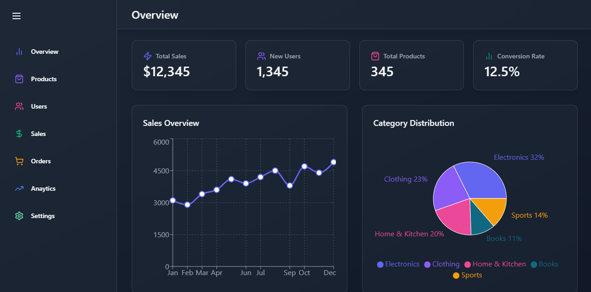
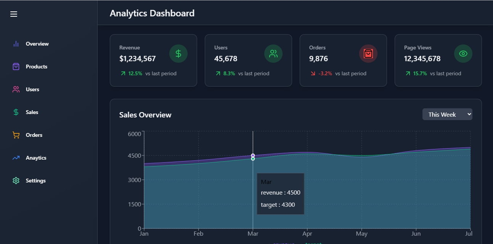

# 📊 Admin Dashboard – React + Recharts + TailwindCSS

Ce projet est un tableau de bord moderne pour administrateur, conçu dans le cadre d'une formation React. Il fournit une interface responsive et dynamique pour visualiser des données clés à l'aide de **Recharts** et stylisé avec **TailwindCSS**.

## 🚀 Fonctionnalités

- Interface utilisateur responsive et claire
- Graphiques interactifs (courbes, barres, radar, etc.) via **Recharts**
- Données simulées (mock data) intégrées
- Composants React modulaires
- Design moderne avec **TailwindCSS**

## 🛠️ Technologies utilisées

- [React](https://reactjs.org/) – Bibliothèque JavaScript pour construire l’interface
- [Recharts](https://recharts.org/) – Librairie de visualisation de données
- [TailwindCSS](https://tailwindcss.com/) – Framework CSS utilitaire

## 📸 Aperçu
Ceci est à quoi ressemble la page d'accueil (Overview) et une page pour les données analytiques





## ▶️ Lancer le projet
```bash
# Cloner le dépôt
git clone https://github.com/Marcel-Fassou-28/react-admin-dashboard.git

# Aller dans le dossier
cd admin-dashboard

# Installer les dépendances
npm install

# Lancer le serveur de développement
npm start
